AUTOMATE INFRASTRUCTURE WITH IAC USING TERRAFORM. PART 3 – REFACTORING

From the two previous projects (i.e project 16 and 17 ) we have developed AWS Infrastructure code using Terraform and tried to run it from our local workstation.
Now it is time to introduce some more advanced concepts and enhance our code. These concepts include modules, S3 backend and DynamoDB.

We are going to change our backend to S3, by default we were using our local storage. Our terraform.tfstate file is stored locally on our machine, and assuming we have different engineers working on this project we need to ensure that everyone working on this project all have the same file across board, so as a result we store the file on cloud for easy access to other engineers and ensuring they all files are same. Also We are going to refactor our code to use modules. Create a directory called modules, and inside it, create directories named VPC, Security, EFS, RDS, ALB, Autoscaling, Compute. These directories created, we are going to copy files related to the named directory e.g For the VPC directory, the files needed to setup our VPC are internet-gateway, Nat-gateway, Routes etc.

Module makes the code reuseable by different engineers , the only thing to be done is just to tweak some parameters to suit your desire. Ensure all the arguments in the module are declared as a variable, just to ensure we do not hardcode values.

Also create variables.tf file in all the created directories, so the content of the directory will have a variables.tf file and other files related to the name of the directories.

The module file structure then looks like this;

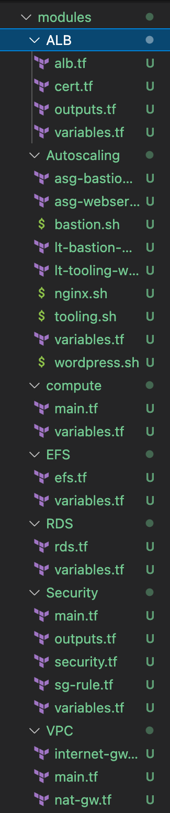

use the link below to access the complete files and codes for this project.

https://github.com/Revelation69/PBL-Project-18.git

After creating all the modules required ran
```
terraform init
```
this is done so that terraform can download the plugins required for the modules about to be created.

ran terraform apply to create all the resources.

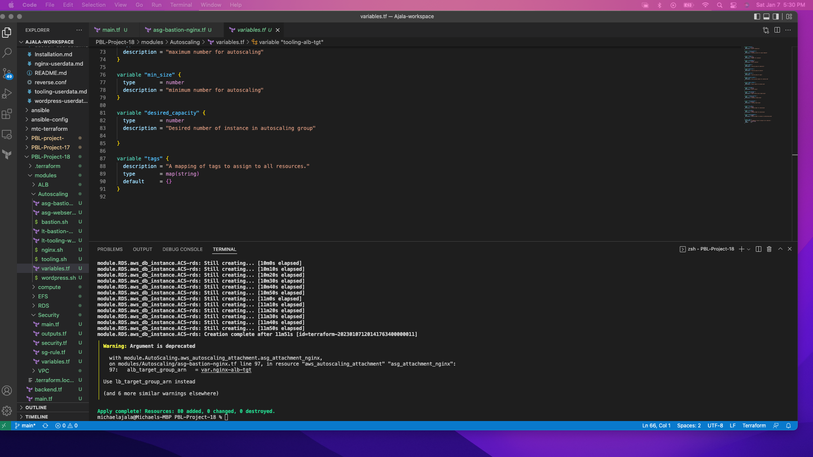

The images below confirms that the resources were created succesfully.

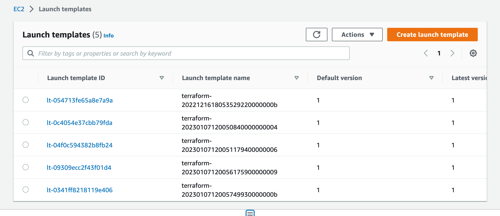

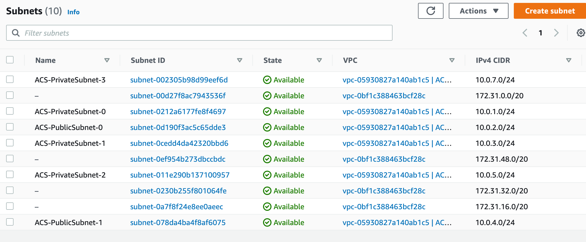

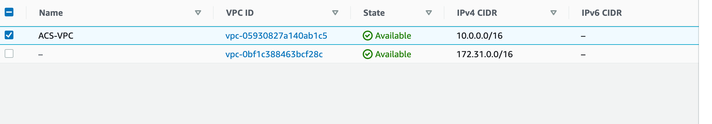

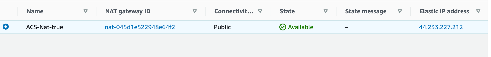

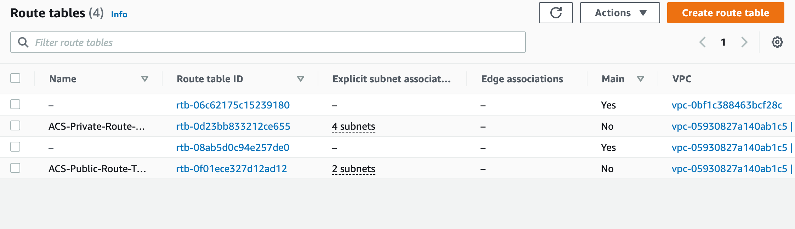

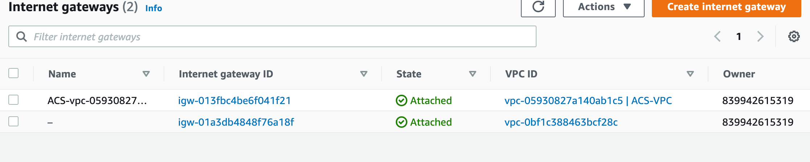

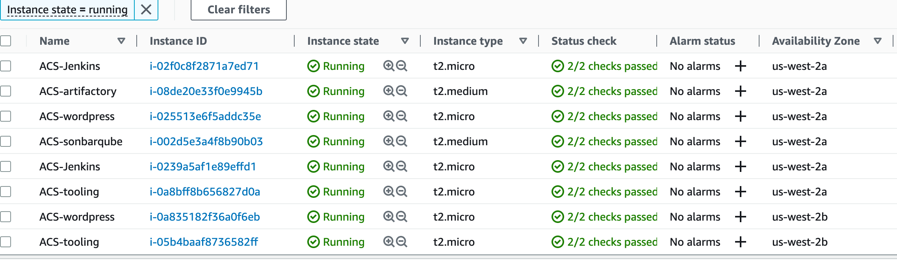

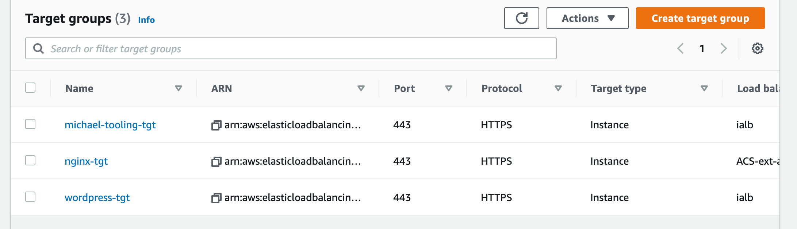

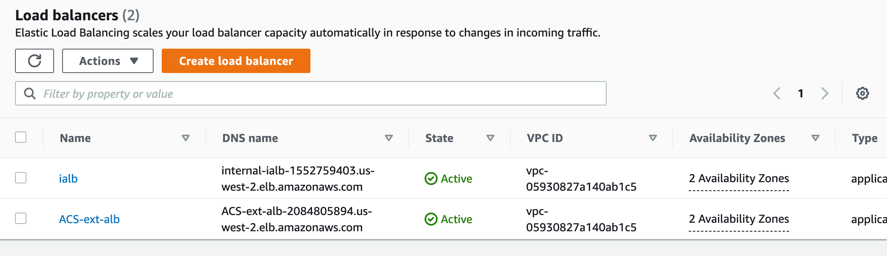

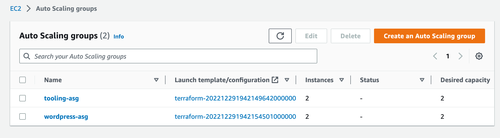

Thus, Backend on S3 was introduced.

So far, we've been using the default backend, which is the local backend - it doesn't require any configuration and stores the states file locally. This mode is suitable for learning purposes, but it is not a robust solution, so it is preferable to store it in a more reliable and durable storage.

The second problem with storing this file locally is that other engineers in a team of multiple DevOps engineers will not have access to a state file stored locally on your computer.

To address this, we'll need to set up a backend from which the state file can be accessed remotely by other DevOps team members. Terraform supports a large number of different standard backends from which to choose. We can use an S3 bucket as a backend because we are already using AWS.

State Locking is another useful option supported by the S3 backend; it is used to lock your state for all operations that could write state. This keeps others from gaining access to the lock and potentially corrupting your state. The S3 backend's state locking feature is optional and requires another AWS service - DynamoDB.


To create an s3 bucket to store Terraform state files

```
resource "aws_s3_bucket" "terraform-state" {
  bucket = "mike-pbl18"

  # force_destroy = true

}

resource "aws_s3_bucket_versioning" "version" {
  bucket = aws_s3_bucket.terraform-state.id
  versioning_configuration {
    status = "Enabled"
  }
}

resource "aws_s3_bucket_server_side_encryption_configuration" "first" {
  bucket = aws_s3_bucket.terraform-state.id

  rule {
    apply_server_side_encryption_by_default {
      sse_algorithm = "AES256"
    }
  }
}
```

the code above was inputed in the main.tf file in the root folder

Note: the name of the bucket must be unique.

The file was updated with the code below to Create a DynamoDB table to handle locks and perform consistency checks.

```
resource "aws_dynamodb_table" "terraform_locks" {
  name         = "terraform-locks"
  billing_mode = "PAY_PER_REQUEST"
  hash_key     = "LockID"
  attribute {
    name = "LockID"
    type = "S"
  }
}
```

ran terraform apply to create the s3 bucket and DynamoDb

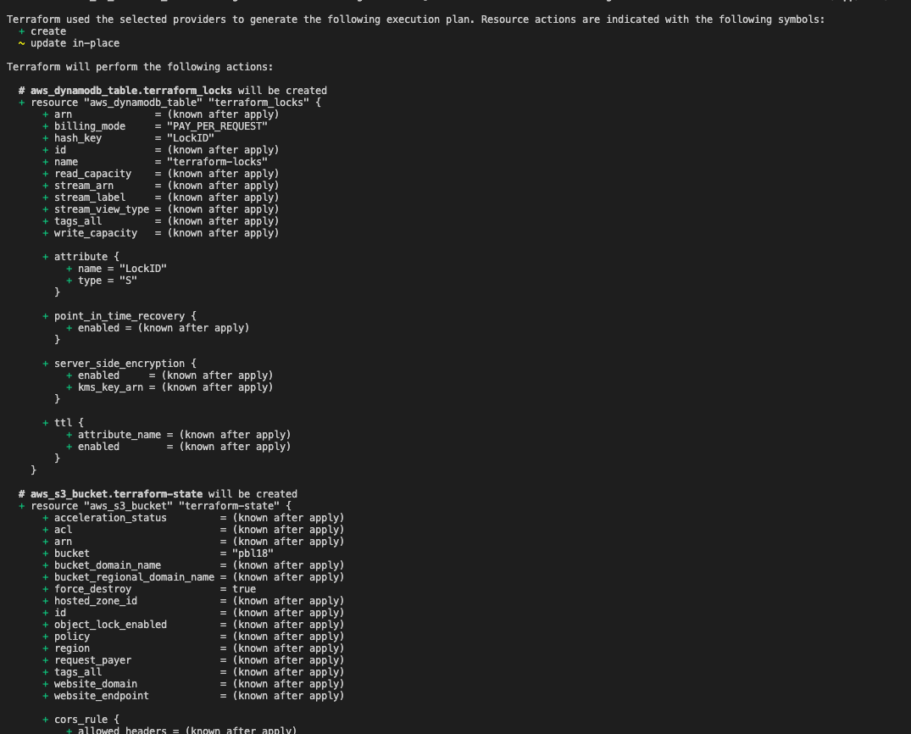

Created a file and named it backend.tf and referenced the bucket name, then configured the backend. Then ran terraform init to make the backend usable. The purpose of this is to migrate our statefile and other files from local storage to S3. as seen below.

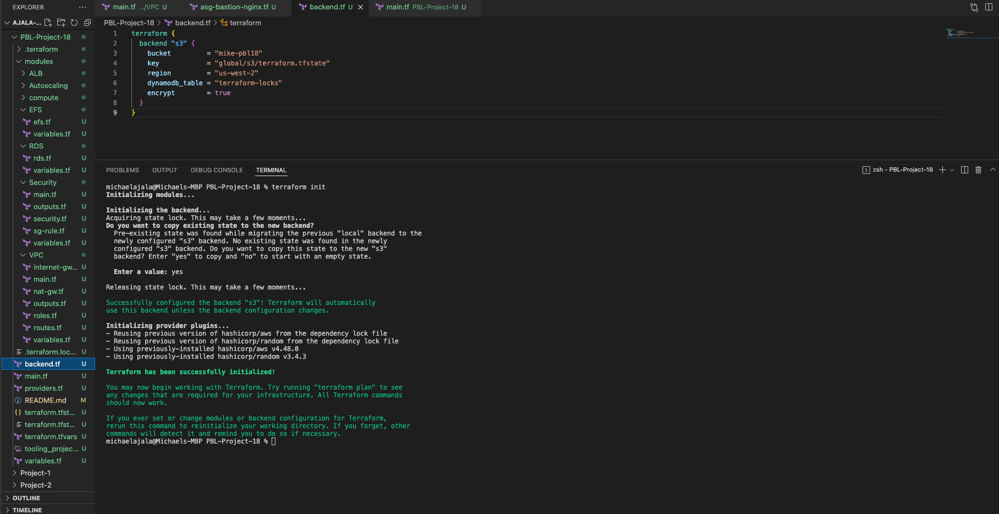

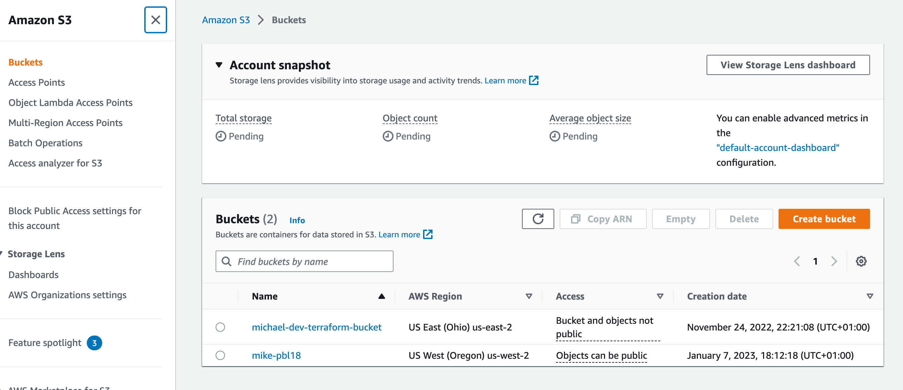

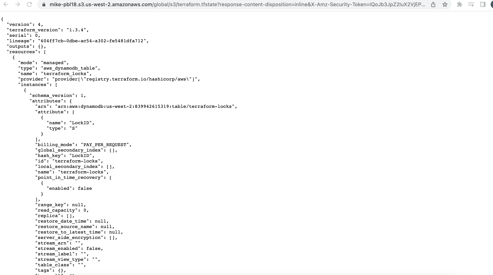

After running terraform plan or apply, a new lock ID would be generated while running the plan. The DynamoDB is handling the lockID, it will be present until the plan or apply finishes. 

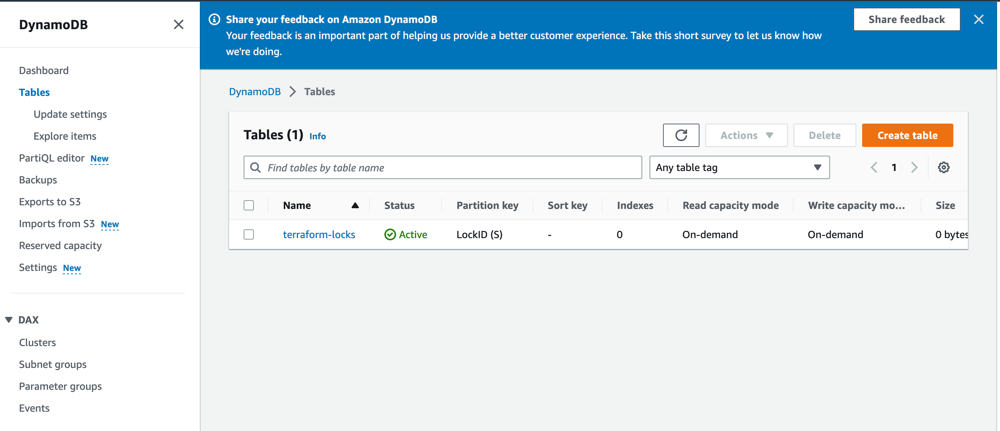

Project Completed!!!

Succesfully refactored the projects to use modules, introduced backend as S3 and also used DynamoDB to store the state lockfiles.

NB. Run terraform detroy. however, before destroying the resourcing comment out the content in backend.tf  then run terraform init -migrate-state this is to copy the statefile back from S3 to local storage.